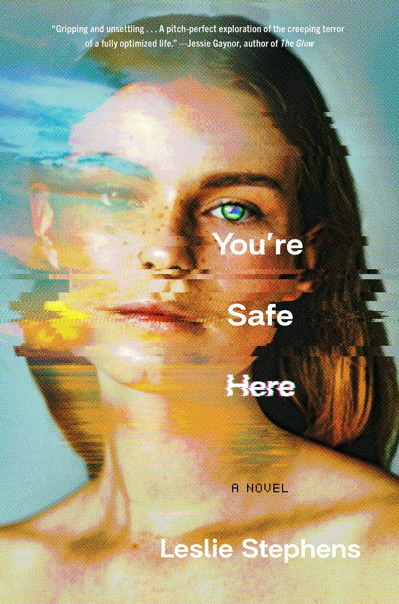

# Title: WellNessNetwork

## Project Description

I will be taking inspiration from a novel I read last spring. You’re safe here is a story set in 2060 centering around a giant tech company that focuses on wellness. They deploy pods off the coast of California that aim to have the user focus on wellness, relaxation and isolation. The user has their day planned for them with recommendations and options that are adjusted based on their state. Throughout the story however we discover the ways in which the program is faulty and the cover-ups that led to such errors.

The wellness network app will have different wellness programs built-in that users can choose from. There will be recommendations and check-ins as well as a social scoring system to boost engagement among the community of users. Food intake, meditation time, physical activity, and daily journaling will be among the parameters considered to give recommendations and score users.

A large portion of this project will be used to discuss the pitfalls of an app like this, the ethics concerns, and the meticulous optimization it would take to be safe and effective for users. This makes the project more of a counterproof of why an app like this should exist.

## Project Goals

1. Simulate what the "wellness pods" looked like in their first days.
2. Test and recalibrate parameters used to build such a program.
3. Discuss the ethics needed to allow such a network to exist.
